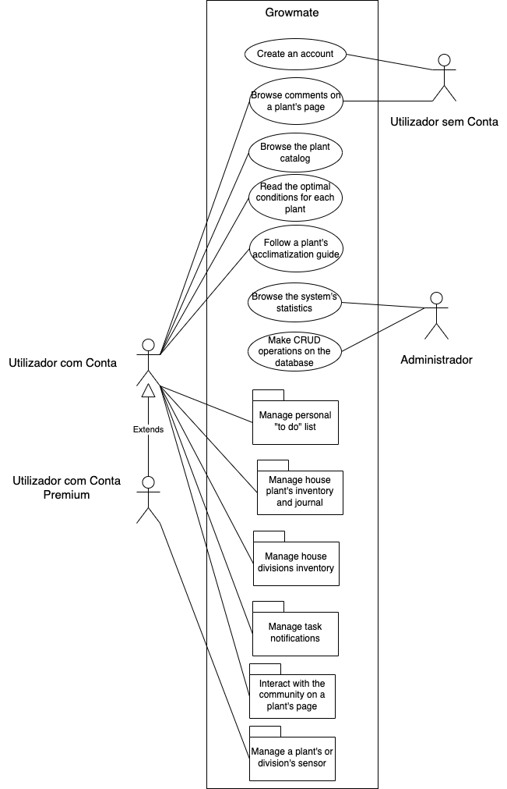
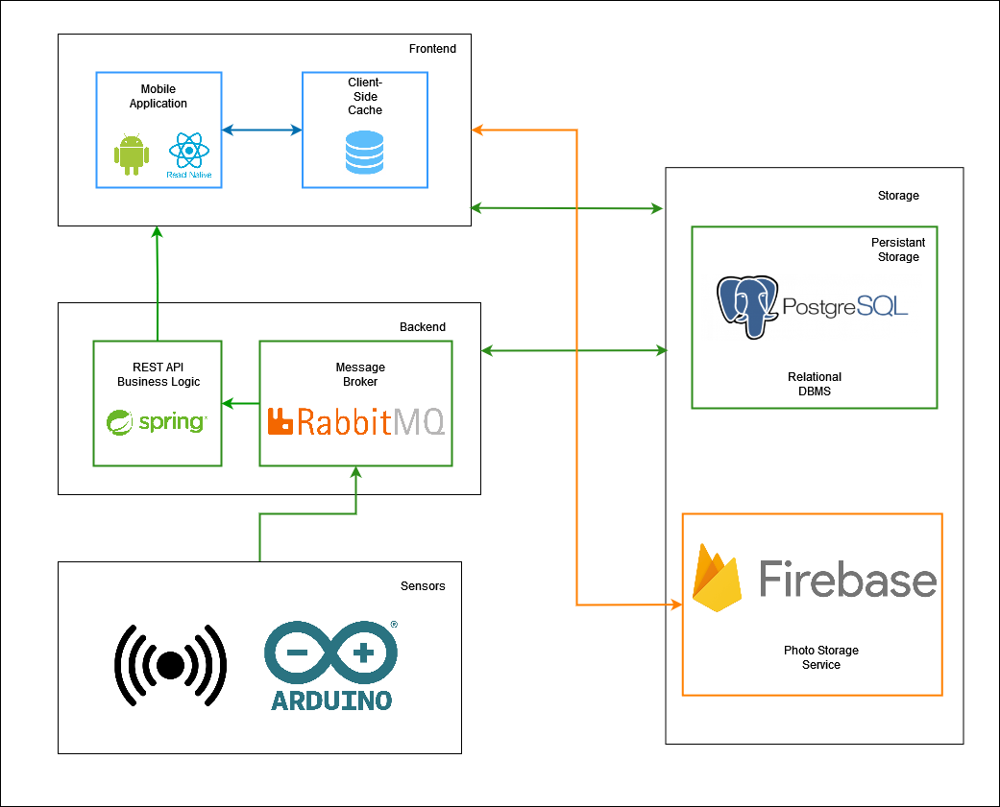

<h1> </img> Project Documentation <small>GrowMate</small> </h1>

## About our project

GrowMate is an application where we allow users of different types to create and manage an inventory of plants they can manage. The application should provide tasks in order to keep the plants healthy, as well as offer tips about how users should care for them.

This will hopefully allow users to have a better sucess rate in growing different types of plants, in an environment where people's daily worries makes them forget about the tasks they should perform.

With this project we intend to aid experienced and non-experienced users to care for their plants and become sucessfull in raising them. We plan to implement sensors in certain division and plants as well (premium user) in order to better calculate what a certain plant needs to continue healthy.

## Functional Requirements <small>Business Rules</small>

### Unregistered users

  <h4> Full catalogue of database's available plants</h4>
  
   - Information about the species, ideal conditions for growth​.  
   - Comments made by users with tips about their experience with the plants​.  
   - Reputation system to influence which users' tips appear, based on their experience​.  

### Registered users

Registered users have <b>access to all of unregistered users functionalities</b> and other functionalities based on the type of account.

#### </b> Non-premium account </b>

  <h4> House Plants Inventory and Management</h4>
  
   - Identify and monitor each individual plant  
   - Journalling system  
   

  <h4> Suggestion of optimal conditions for each plant​</h4>
  
   - Optimal temperature, humidity, luminosity and water frequency​.  
   - Ideal soil mix, pot size and recommendations of additional nutrients and fertilizers​.  
   - Expected color, size and condition  
   - Tips on detection of pests and disease symptoms​ 

  <h4> Scheduling of tasks for plant maintenance​​</h4>

- With the implementation of notifications and reminders  

  <h4> Suggestion of new plants to grow​​​</h4>

- Considers the similarity with plants in the inventory of the user, as well as difficulty​  
- Takes into account the climate​  

  <h4> Acclimatization guide for newly bought plants, when necessary​​​</h4>

  <h4> Potential intergration with weather API​</h4>

#### </b> Premium account </b>

<b> Besides previous requiremets </b>, premium account users also have access to the following requirements.

  <h4> Integration with measurements provided by sensors​​</h4>

- Sensors that measure the individual characteristics of a plant – soil moisture.​​  
- Sensors that measures shared characteristics of all plants in a division – air temperature and humidity.​  

  <h4> Plant condition presented in a traffic light system​​​</h4>

- Comparison between measured conditions and optimal conditions​.  

### Other requirements

#### Administrative Functions

  <h4> Web Dashboard for database administrator​​​</h4>

- Admin can do CRUD operations over the database​.  
- Admin can see relevant statistics related to the users. ​ 

#### Authentication and Authorization Levels

  <h4> Separation of functionalities according to the type of account​.​</h4>

#### Historical Data

  <h4> History of a user’s actions and history of sensors measurement for each plant​.​</h4>

## Actors

Our platform will support four types of actors:

- System Administrator
- User without account
- User with account
- User with premium account

## Use Cases

Our use cases can be described through the following diagram:

 

</img>

 

## Non-Functional Requirements

<h3> Usability </h3>

The application should be developed bearing in mind that the target audience is comprised of people from all age groups and with varied technological backgrounds. Thus, and considering the app will be developed for mobile devices, its interface should be easy to learn and intuitive, and be validated with usability tests with users representing this varied background.

<h3> Reliability </h3>

The different subsystems of the architecture should be well connected and reliable.

When system errors happen, the application should be responsive, so the user realizes what is happening and doesn’t abandon the system.

<h3> Scalability </h3>

The user should be able to connect new sensors to their account whenever needed and associate these sensors with different divisions and plants. Thus, the architecture of the message broker should be implemented with this in mind.

The app should be able to accommodate multiple users connecting at the same time.

<h3> Security </h3>

Given that the application won’t deal with sensitive data from its users, the focus on our project will be on the protection of the login information of the users. This will be dealt not only with password encryption and the development of an authentication and authorization system, but also with the implementation of token-based authentication and security methods on the API itself.

<h3> Interoperability </h3>

The mobile application is required to connect with different sensors used to monitor the plants belonging to the user (temperature and humidity sensors, as well as soil moisture sensors). In the context of the development during this project, the connection will be made via middleware installed on a Raspberry Pi.

<h3> Efficiency </h3>

Given that mobile devices have limited storage and battery resources, the development of the mobile app should be made in an efficient manner in order to optimize the system. The Android guidelines for application optimization should be followed.

## System Architecture

### Domain Model

 

  <h4> Users </h4>

The Users of the application can either be premium, with access to the features of the app relating to the integration of sensors, or non-premium.

Either way, internally, all Users will have a <b>rating</b> that will be used to measure their experience with the app and their experience growing plants. This rating will be employed as part of the reputation system that will be implemented for the user suggestions forum for each plant in the app catalogue.

Users will also be able to register in their account all the plants they want to monitor in their house.

  <h4> Plants </h4>

The association between User and Plant is one-to-many, to represent the inventory of plants of each user, since a user can have several plants in their inventory.

Each plant will have a set of information related to the details described by the User, such as the plantation date or the size of the pot used. Besides, all plants will belong to one of the Plant Species catalogued in the system database.

The stats about the plants, as well as their optimal conditions, will be used to determine each Plants estimated plant condition. This will be implemented using a “traffic lights” system which will allow the User to glance at first sight which plants in their inventory currently need attention - with red signaling the need for immediate attention, green signalling that the plant is in a healthy state, and yellow signaling an intermediate state between both.

The estimation of the plant condition can be better measured by the association of sensors to each plant, in the case of Premium Users.

<h4> Plant Species </h4>

Each plant species will have their ideal conditions for growth registered, and also include their optimal temperature, optimal luminosity, optimal humidity and watering frequency.

They will be evaluated according to a scale suggested by the University of Georgia:

<table class="table table-striped">
  <thead>
	  <tr>
	  	<th>Condition</th>
	  	<th>Levels in Scale</th>
	  	<th>Scale Description</th>
	  </tr>
	  </thead>
	  <tbody>
	  <tr>
	  	<td scope="row">Light</td>
	  	<th>4</th>
	  	<td>
      1 -  Sunny light areas: At least 4 hours of direct sun  
      2 – High-light area: Over 200 ft-c, but not direct sun  
      3 – Medium-light areas: 75 ft-c to 200 ft-c  
      4 - Low-light areas: 25 ft-c to 75 ft-c
      </td>
	  </tr>
	    <td scope="row">Temperature</td>
	  	<th>3</th>
	  	<td>
        1 – Cool: 10ºC at night; 18 ºC at day  
        2 – Average:  18ºC at night; 25 ºC at day  
        3 – Warm: 25ºC at night; 30 ºC at day 
      </td>
	  </tr>
	  <tr>
	    <td scope="row">Relative Humidity</td>
	  	<th>3</th>
	  	<td>
        1 – High: 50% or higher  
        2 – Average: 25% to 49%  
        3 – Low: 5% to 24% 
      </td>
	  </tr>
    <tr>
	    <td scope="row">Watering</td>
	  	<th>3</th>
	  	<td>
        1 – Keep soil mix moist  
        2 – Surface of soil mix should dry before re-watering  
        3 – Soil mix can become moderately dry before re-watering 
      </td>
	  </tr>
  </tbody>
</table>

  <h4> Divisions </h4>

For each Plant, the user can register in which Division of their house the pot is located. As such, it will be possible to measure the different air humidity and temperature values through sensors in those divisions.

  <h4> Species Family</h4>

Each species belongs to a Species Family, which determines their ideal soil mix

- Flowering House Plants
- Foliage Plants
- Bromeliads
- Orchids
- Succulents and Cacti
- Ferns
- African Violets and other Gesneriads

  <h4> Tasks </h4>

The tasks related to the care for each plant will have a status associated to them (<i>to be completed</i> or <i>done</i>) and will also be used to determine the current condition of a plant.

  <h4> Sensors </h4>

Premium Users will be able to associate two types of Sensors to their account: either <b>Plant Sensors</b>, that measure a parameter that varies from individual plant to individual plant (i.e., their soil moisture), or <b>Division Sensors</b>, which monitor parameters that don’t vary from plant to plant but that are actually dependent on environmental conditions (i.e., the air humidity and temperature).

A record for all the measurements will be kept and sensors will also produce notifications in case a measure has worrying values.

### System Architecture & Deployment

The architecture of the solution will be divided into 4 main modules: the Frontend, the Backend, the Storage and the Sensors Architecture.

</img>

#### 
<b>Frontend</b>

The Frontend of the system consists of a main mobile application, developed using the <b>React Native</b> framework, for the Android OS.

The choice of the React Native Framework for the implementation of this module is due to its component-based development and the ease with which we can use additional libraries for routing and client-side functionality. These characteristics make the framework ideal to implement a well-designed and usable responsive interface for the users in a relatively simple and fast manner, while making the code easy to test, to read and to maintain.

We implemented <b>Async Storage</b> as a client-side cache to store various data, including user session information and static content like plant Categories and Species. This cache is refreshed automatically every 24 hours to ensure the data remains up to date.

#### 
<b>Backend</b>

The backend of the system consisted of a REST API, that will serve as an interface both the Frontend and the Storage layers while processing business logic, and the <b>Rabbit MQ</b> message queue, which will be used has a broker to receive the measurements data from the sensors and exchange this information with the Storage module.

The REST API will be developed on the <b>Spring Framework</b>, which also allows the easy implementation of a data modelling and processing layer, using Spring Data.

#### 
<b>Storage</b>

For the storage module, we decided to use a relational DBMS, namely, <b>Postgres SQL</b>. This allows the implementation of a relational database that will hold the information about the users, their profiles, their inventory of plants, the tasks related to their inventory, etc., as well as the catalogue of the different species supported by the platform, as well as the information characterizing these different species.

The records for the measurements done by each sensor are also stored in this relational database, being received by the backend module on Spring Boot, on classes used to listen to the messages posted on their corresponding RabbitMQ broker topics.

In addition, we employed <b>Firebase</b> as our cloud storage solution for storing photos. By leveraging Firebase's capabilities, we were able to securely upload and store images in the cloud. This allowed us to efficiently manage and retrieve the photos whenever needed, providing a reliable and scalable solution for handling our media assets.

#### 
<b>Sensors Architecture</b>

Two types of sensors were employed for data collection. The first sensor utilized was a <b>resistive soil moisture</b> sensor, which accurately measured the humidity levels of the soil. Additionally, we incorporated a <b>DHT11</b> sensor capable of measuring both temperature and air humidity. To facilitate the data transfer process, we connected these sensors to a <b>nodeMCU</b>, which is equipped with an <b>ESP8266</b> microchip that includes built-in TCP/IP networking software. This configuration allowed the nodeMCU to establish a connection with the RabbitMQ server and efficiently transmit the collected measurements to their respective queues.

#### 
<b>Deployment</b>

The deployment architecture consisted of three main components, each represented by different colors. The containers deployed within an <b>Azure Virtual Machine</b> were depicted as green boxes. These containers included a Spring Boot container, RabbitMQ, and a PostgreSQL database. To enable effective communication, the Azure Virtual Machine was customized to expose ports 80 for the API and 1883 for the MQTT RabbitMQ service. This customization allowed seamless interaction between the components and offered scalability, flexibility, and simplified management through Azure VM infrastructure. Furthermore, the Azure VM provided robust security measures and comprehensive monitoring capabilities, ensuring the stability and reliability of the deployed containers.

The <b>Firebase cloud service</b>, represented by the orange box, served as a reliable and scalable backend photo storage service for the application.

The front-end application, depicted by the blue boxes, was an <b>Android APK</b> developed using <b>Expo Application Services</b>. Expo simplified the deployment process by generating the build from the React Native application we developed.
